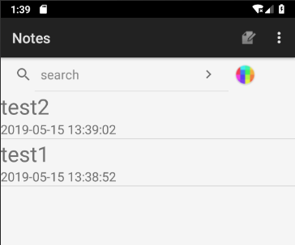
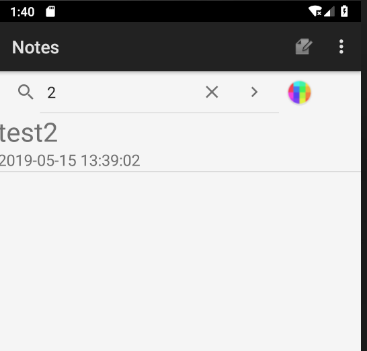
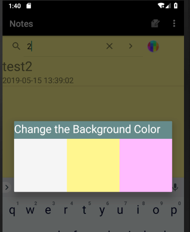
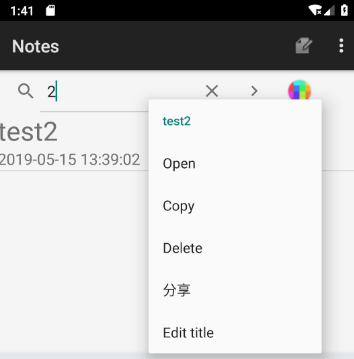
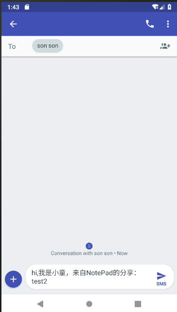
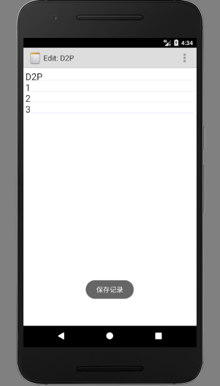
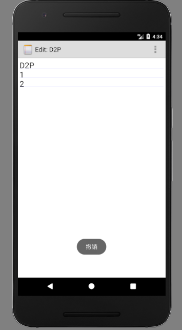
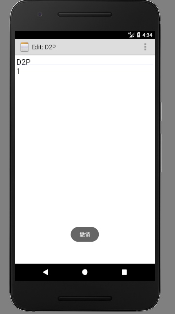

# NotePad
功能如下：
* 添加时间戳 
* 查询框
* 修改背景色 
* 添加分享功能
* 添加撤销操作
## 一.添加时间戳 
### 1.新建一个noteslist_item_new.xml,在这中间设置要显示的时间框以及图片
```java
<?xml version="1.0" encoding="utf-8"?>
<LinearLayout xmlns:android="http://schemas.android.com/apk/res/android"
    android:orientation="vertical"
    android:layout_width="match_parent"
    android:layout_height="wrap_content"
    android:descendantFocusability="blocksDescendants"
    android:id="@+id/notesItem"
    android:weightSum="1">
        <!--android:layout_marginBottom="5dp"-->
        <LinearLayout
            android:layout_width="match_parent"
            android:layout_height="1dp"
            android:background="#00000000"
            android:layout_marginTop="10dp"
            >

        </LinearLayout>

        <LinearLayout
            android:layout_width="match_parent"
            android:layout_height="85dp"
            android:orientation="horizontal"
            android:layout_weight="2.95"
            android:weightSum="1">

            <ImageView
                android:layout_width="81dp"
                android:layout_height="71dp"
                android:layout_marginTop="5dp"
                android:layout_marginBottom="5dp"
                android:background="@drawable/cute" />

            <LinearLayout
                android:layout_width="wrap_content"
                android:layout_height="match_parent"
                android:orientation="vertical"
                android:weightSum="1"
                android:layout_weight="1.42">

                <TextView
                    android:id="@+id/mytitle"
                    android:layout_width="match_parent"
                    android:layout_height="wrap_content"
                    android:layout_marginLeft="10dp"
                    android:layout_marginTop="5dp"
                    android:text="Title"
                    android:textColor="#3333FF"
                    android:textSize="20sp"
                    android:layout_weight="0.38"/>

                <TextView
                    android:id="@+id/time"
                    android:layout_width="match_parent"
                    android:layout_height="wrap_content"
                    android:layout_marginLeft="10dp"
                    android:layout_marginTop="5dp"
                    android:text="2017/4/25 16:25:30"
                    android:textColor="#000000" />
            </LinearLayout>

            <LinearLayout
                android:layout_width="87dp"
                android:layout_height="wrap_content"
                android:layout_marginTop="10dp"
                android:orientation="horizontal"
                android:weightSum="1">

                <ImageButton
                    android:id="@+id/deleteButton"
                    android:layout_width="wrap_content"
                    android:layout_height="wrap_content"
                    android:src="@drawable/ic_menu_delete"
                    android:background="@android:color/transparent"/>
            </LinearLayout>

        </LinearLayout>
    </LinearLayout>
```
### 2.发现在NotPadProvider中已经提供NotePad.Notes.COLUMN_NAME_MODIFICATION_DATE,于是进入notelist.java PROJECTION 契约类的变量值加一列。
```java
private static final String[] PROJECTION = new String[] {
            NotePad.Notes._ID, // 0
            NotePad.Notes.COLUMN_NAME_TITLE,// 1
            //加上时间
           NotePad.Notes.COLUMN_NAME_MODIFICATION_DATE
 //2

    };
```
### 3.修改SimpleCursorAdapter
```java
String[] dataColumns = {NotePad.Notes.COLUMN_NAME_TITLE, NotePad.Notes.COLUMN_NAME_MODIFICATION_DATE};
int[] viewIDs = {R.id.mytitle, R.id.time};
```
### 4. 修改adapter中的参数     
```java
    adapter
        = new MySimpleCursorAdapter(
        this,                             // The Context for the ListView
        R.layout.noteslist_item_new,          // Points to the XML for a list item
        cursor,                           // The cursor to get items from
        dataColumns,
        viewIDs
);

```
### 5.在NoteEditor.java中的updateNote函数上添加获取时间的代码     
```java
 SimpleDateFormat format = new SimpleDateFormat("yyyy-MM-dd HH:mm:ss");
String time=format.format(new Date());
values.put(NotePad.Notes.COLUMN_NAME_MODIFICATION_DATE,time);
);

```

### 6.成功显示时间戳
-------
  
-------
## 二.查询框
* 如果想在屏幕中显示其他控件，可以采用如下方法：1.代码中添加：setContentView(R.layout.main)2.在xml文件中添加一个LIstView控件和一个SearchView控件，注意LIstView控件id必须为"@id/Android:list"表示匹配的ListView  
### 1.创建一个新的notepad_main.xml，在这里面设置搜索框
```java
    <SearchView
    android:layout_width="310dp"
    android:layout_height="wrap_content"
    android:id="@+id/search"
    android:textColor="@android:color/black"
    android:layout_alignParentTop="true"
    android:layout_marginRight="10dp" />
    
```
### 2.在NoteList.java中设置该搜索框所提示的文字
```java
   SpannableString spannableString = new SpannableString("search");
   spannableString.setSpan(new ForegroundColorSpan(Color.BLACK), 0,  spannableString.length(),
   Spannable.SPAN_INCLUSIVE_EXCLUSIVE);
searchView.setQueryHint(spannableString);
```
### 3.创建并 获取searchview控件
```java
   private SearchView searchView;
searchView = (SearchView) findViewById(R.id.search);
   searchView.setIconifiedByDefault(false);
   searchView.setSubmitButtonEnabled(true);
```
### 4. 设置当点击搜索按钮时触发的方法和搜索内容改变时触发的方法
```java
   searchView.setOnQueryTextListener(new SearchView.OnQueryTextListener() {
    @Override
    public boolean onQueryTextSubmit(String s) {

        if (searchView != null) {
            //得到输入管理对象
            InputMethodManager imm = (InputMethodManager) getSystemService(Context.INPUT_METHOD_SERVICE);
            if (imm != null) {
                        imm.hideSoftInputFromWindow(searchView.getWindowToken(), 0);
            }
            //不获取焦点
            searchView.clearFocus();
        }
        return false;

    }

    @Override
    public boolean onQueryTextChange(String s) {
        cursor = managedQuery(
                getIntent().getData(),            // Use the default content URI for the provider.
                PROJECTION,                       // Return the note ID and title for each note.
                NotePad.Notes.COLUMN_NAME_TITLE + " LIKE '%" + s + "%'",// search the title
                null,                             // No where clause, therefore no where column values.
                NotePad.Notes.DEFAULT_SORT_ORDER  // Use the default sort order.
        );
        adapter.swapCursor(cursor);
        return true;
    }
});

```
### 5.在NoteList.java中的onCreate方法中添加setContentView(R.layout.notepad_main);这句话，实现搜索框
-------
  
-------
## 三.修改背景色
###  1.先创建一个change_backgroundcolor.xml
```java
  <?xml version="1.0" encoding="utf-8"?>
<LinearLayout xmlns:android="http://schemas.android.com/apk/res/android"
    android:layout_width="match_parent"
    android:layout_height="match_parent"
    android:orientation="vertical">
    <LinearLayout
        android:layout_width="match_parent"
        android:layout_height="40dp"
        android:background="#668B8B">
        <TextView
            android:layout_width="wrap_content"
            android:layout_height="wrap_content"
            android:text="Change the Background Color"
            android:gravity="center"
            android:textSize="25dp"
            android:textColor="@android:color/white"/>
    </LinearLayout>
    <LinearLayout
        android:layout_width="match_parent"
        android:layout_height="120dp"
        android:orientation="horizontal"
        android:clickable="true">
        <TextView
            android:layout_width="match_parent"
            android:layout_height="match_parent"
            android:id="@+id/color1_grey"
            android:background="#f5f5f5"
            android:clickable="true"
            android:layout_weight="1"/>
        <TextView
            android:layout_width="match_parent"
            android:layout_height="match_parent"
            android:id="@+id/color2_yellow"
            android:background="#FFF68F"
            android:clickable="true"
            android:layout_weight="1"/>
        <TextView
            android:layout_width="match_parent"
            android:layout_height="match_parent"
            android:id="@+id/color3_pink"
            android:background="#FFBBFF"
            android:clickable="true"
            android:layout_weight="1"/>
    </LinearLayout>

</LinearLayout>

```

###  2. 然后创建一个在notepad_main.xml中创建ImageButton变量，并在onCreate()中获取控件同时设置点击事件
```java
   <ImageButton
    android:id="@+id/colorChange"
    android:layout_width="61dp"
    android:layout_height="match_parent"
    android:src="@drawable/color"
    android:background="@android:color/transparent" />
```
```java
    colorImageButton =(ImageButton)findViewById(R.id.colorChange);
```
###  3. 点击事件
```java
   colorImageButton.setOnClickListener(new View.OnClickListener() {
    @Override
    public void onClick(View view) {
        //点击该按钮时显示出修改背景颜色的对话框
        final AlertDialog alertDialog=new AlertDialog.Builder(NotesList.this).create();
        alertDialog.show();
        Window window=alertDialog.getWindow();
        window.setContentView(R.layout.change_backgroundcolor);
         final LinearLayout linearLayout=(LinearLayout)findViewById(R.id.main);
        //获取不同颜色的显示
        TextView textView_grey=(TextView)alertDialog.getWindow().findViewById(R.id.color1_grey);
        TextView textView_yellow=(TextView)alertDialog.getWindow().findViewById(R.id.color2_yellow);
        TextView textView_pink=(TextView)alertDialog.getWindow().findViewById(R.id.color3_pink);
        //对各种颜色进行事件监听
        textView_grey.setOnClickListener(new View.OnClickListener() {
            @Override
            public void onClick(View view) {
                currentColor="#f5f5f5";
                linearLayout.setBackgroundColor(Color.parseColor(currentColor));
                //设置笔记本背景颜色
                putColor(currentColor);
                alertDialog.dismiss();
                
            }
        });

    textView_yellow.setOnClickListener(new View.OnClickListener() {
        @Override
        public void onClick(View view) {
            currentColor="#FFF68F";
            linearLayout.setBackgroundColor(Color.parseColor(currentColor));
            putColor(currentColor);
            alertDialog.dismiss();
        }
    });
        textView_pink.setOnClickListener(new View.OnClickListener() {
            @Override
            public void onClick(View view) {
                currentColor="#FFBBFF";
                linearLayout.setBackgroundColor(Color.parseColor(currentColor));
                putColor(currentColor);
                alertDialog.dismiss();
            }
        });
     }

});

```
###  4.其中使用SharedPreferences保存颜色的方法putColor()如下：
```java
    private void putColor(String color){
        SharedPreferences preferences = getSharedPreferences("preferences", Context.MODE_PRIVATE);
        SharedPreferences.Editor editor = preferences.edit();
        editor.putString("color", color);
        editor.commit();
    }
```
### 5.结果
-------
  
-------

-------

-------
## 四.添加分享功能
  选择某一条note，点击可将内容分享至其他应用，使用Intent.ACTION_SEND来实现。具体效果和代码如下  


###  1.设置好点击事件后，通过获取当前选中的note的内容（mCursor.getString(1)即为我们要获取的内容），然后将其分享到我们想要分享的应用  

```java
       Uri noteUri = ContentUris.withAppendedId(getIntent().getData(), info.id);
        Cursor mCursor = managedQuery(
                noteUri,         // The URI that gets multiple notes from the provider.
                PROJECTION2,   // A projection that returns the note ID and note content for each note.
                null,         // No "where" clause selection criteria.
                null,         // No "where" clause selection values.
                null          // Use the default sort order (modification date, descending)
        );

```

```java
        Intent intent = new Intent(Intent.ACTION_SEND);
                    intent.setType("text/plain");
                    intent.putExtra(Intent.EXTRA_SUBJECT, "分享");
                    intent.putExtra(Intent.EXTRA_TEXT, "hi,我是小童，来自NotePad的分享："+mCursor.getString(1));
                    startActivity(Intent.createChooser(intent, "分享到"));

```

### 3.结果
-------
  

  
-------

###  五.按步撤销功能

#####  源工程中已经含有撤销功能，但是只是针对于一次性撤销，即将该日记重置为打开前的状态。我实现的撤销在于可以记录你的每一次“点击保存”前的状态，这样在写长文本日记的时候比较方便，不用一步推倒，重新来过。


演示如下
##### 撤销前先点击保存记录

  

  

  


** 基于备忘录模式，自定义控件NoteEdittext继承自EditText，增加了可以保存历史文本内容的功能 **


```
public class Memento {
    private String text;
    private int cursor;

    public String getText() {
        return text;
    }

    public void setText(String text) {
        this.text = text;
    }

    public int getCursor() {
        return cursor;
    }

    public void setCursor(int cursor) {
        this.cursor = cursor;
    }
}

```


```
public class NoteCaretaker {
    //最大存储量
    private static final int MAX = 30;
    List<Memento> mMementoList = new ArrayList<>(MAX);

    int mIndex = 0;//索引

    public void saveMemento(Memento memento) {
        if (mMementoList.size() > MAX) {
            mMementoList.remove(0);//存满之后从第一条开始删
        } else {
            mMementoList.add(memento);
            mIndex = mMementoList.size() - 1;
        }
    }

    //获取上一个存档信息
    public Memento getPrevMemento() {
        mIndex = mIndex > 0 ? --mIndex : 0;
        return mMementoList.get(mIndex);
    }

    //重做
    public Memento getNextMemento() {
        mIndex = mIndex < mMementoList.size() - 1 ? ++mIndex : mIndex;
        return mMementoList.get(mIndex);
    }

}
```

```
public class NoteEditText extends android.support.v7.widget.AppCompatEditText {
public Memento mementoFactory() {
      Memento noteMemento = new Memento();
      noteMemento.setText(getText().toString());
      noteMemento.setCursor(getSelectionStart());
      return noteMemento;
  }

  public void restore(Memento memento) { //撤销
      setText(memento.getText());
      setSelection(memento.getCursor());
  }
//省略部分代码，具体实现请看源码
}

```